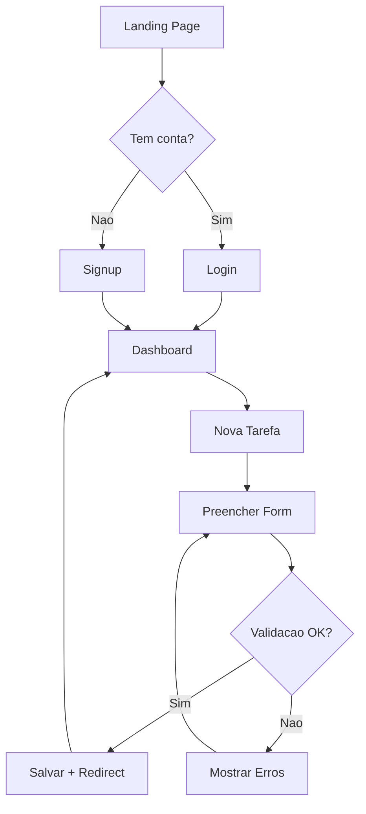
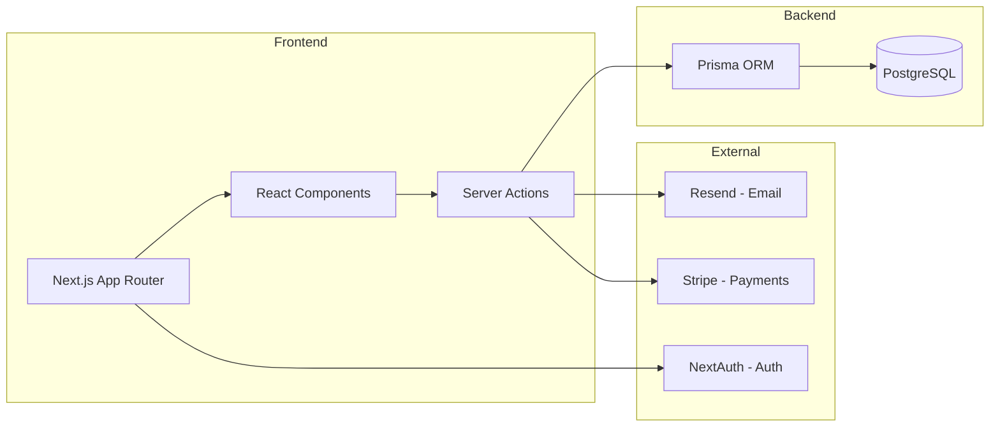
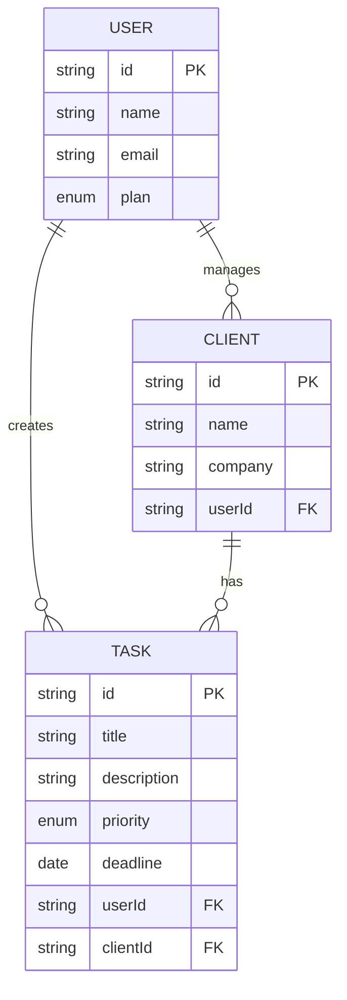

# Guia do /brief — Da Ideia ao Briefing com Artefatos

O /brief e o comando OPCIONAL que existe para quando voce esta comecando algo do zero.
Ele transforma uma ideia vaga em um briefing completo com artefatos visuais
(PRD, diagramas, wireframes) que servem de input para o /spec.

**Quando usar:** Projeto novo, produto novo, app do zero.
**Quando NAO usar:** Feature em projeto existente, alteracao, correcao — nestes casos, va direto pro /spec.

---

## O que o /brief produz

Uma pasta `docs/brief/` com artefatos que materializam a ideia antes de qualquer codigo:

```
docs/brief/
├── BRIEF.md              ← PRD compacto (problema, solucao, escopo, stack)
├── user-flows.mermaid    ← Diagramas de fluxo do usuario
├── architecture.mermaid  ← Diagrama de arquitetura (componentes do sistema)
├── wireframes.html       ← Wireframes HTML das telas principais (low-fidelity)
├── data-model.mermaid    ← Modelo de dados (entidades e relacoes)
└── decisions.md          ← Registro de decisoes tomadas durante o brief
```

Nem todos os artefatos sao obrigatorios — depende do projeto:

| Artefato | Quando gerar | Quando pular |
|---|---|---|
| BRIEF.md | Sempre | Nunca — e o output principal |
| user-flows.mermaid | Sempre que tem fluxos de usuario | CLI tools, APIs puras |
| architecture.mermaid | Projetos com backend, integrações, ou multiplos servicos | Landing pages simples |
| wireframes.html | Projetos com UI (web, mobile) | APIs, CLIs, scripts |
| data-model.mermaid | Projetos com banco de dados | Static sites, tools sem persistencia |
| decisions.md | Sempre | Nunca — registra o "por que" das escolhas |

---

## Fluxo do /brief — Entrevista Interativa

O /brief funciona como um dialogo estruturado em 6 fases.
A IA nao so coleta informacao — ela desafia, sugere e forca decisoes explicitas.

### Fase 1: Captura de Intent

**Objetivo:** Entender O QUE e POR QUE antes de qualquer detalhe.

Perguntas iniciais:
- "O que voce quer construir? (pode ser vago, vou refinar)"
- "Qual problema isso resolve? O que existe hoje que e ruim?"
- "Quem vai usar isso? Descreva o usuario tipico"
- "Isso e algo completamente novo ou substitui algo que ja existe?"

**Tecnica de elicitacao:**
Nao aceitar respostas vagas. Se o usuario diz "um app de tarefas", perguntar:
- "Tarefas pessoais ou de time?"
- "Simples tipo todo-list ou com prioridades, deadlines, clientes?"
- "O que diferencia isso do Todoist, Asana, Notion?"

Forcar a ambiguidade a virar decisao explicita.

Saida: Problema, solucao e publico claros.

### Fase 2: Escopo e Funcionalidades Core

**Objetivo:** Separar essencial de nice-to-have e identificar o fluxo critico.

Perguntas:
- "Quais sao as 3-5 funcionalidades que fazem isso ser util? (core, sem frescura)"
- "O que explicitamente NAO faz parte do MVP?"
- "Tem algum fluxo que e o coracao do produto? (o fluxo que se nao funcionar, nada funciona)"
- "Quantas telas/paginas voce imagina grosseiramente?"

**Tecnica de elicitacao:**
Se o usuario lista mais de 7 funcionalidades, desafiar:
- "Se voce pudesse lancar com apenas 3 dessas, quais seriam?"
- "Qual dessas features voce cortaria se tivesse metade do prazo?"

Saida: Lista de funcionalidades MVP + fora de escopo + fluxo principal.

### Fase 3: Referencia Visual e Design

**Objetivo:** Entender de onde vem a referencia visual e como a IA vai se guiar.

Perguntas:
- "Voce tem designs prontos? (Figma, Google Stitch, mockups, screenshots)"
- "Se nao tem design, tem alguma referencia visual? (app/site que voce gosta do estilo)"
- "Tem preferencia de estilo? (minimalista, colorido, dashboard-style, etc.)"
- "Ja tem logo, cores, fontes definidas?"

| Resposta do usuario | Acao |
|---|---|
| "Tenho designs no Figma" | Registrar link + verificar se MCP esta conectado |
| "Tenho no Google Stitch" | Registrar link + pedir export de screenshots |
| "Tenho mockups/screenshots" | Pedir para compartilhar + registrar |
| "Tenho referencias visuais" | Registrar links dos sites/apps de referencia |
| "Nao tenho nada" | Gerar wireframes HTML basicos como ponto de partida |

Saida: Fonte de interface identificada + referencias visuais registradas.

### Fase 4: Stack e Restricoes

Perguntas:
- "Ja decidiu a stack tecnica? (ou quer sugestao baseada no projeto?)"
- "Tem integracao com algum sistema externo? (pagamento, email, auth third-party)"
- "Tem prazo? Vai ser desenvolvido por quem? (voce sozinho, equipe, com IA?)"
- "Alguma restricao tecnica? (precisa ser mobile, precisa funcionar offline, etc.)"

**Tecnica de elicitacao:**
Se o usuario nao tem stack definida, SUGERIR com justificativa:
- "Para este tipo de projeto, recomendo [stack] porque [razao]. Faz sentido?"

Saida: Stack definida (ou marcada como "a definir") + restricoes mapeadas.

### Fase 5: Gerar Artefatos Visuais

**ESTA E A FASE QUE DIFERENCIA NOSSO /brief.**

Apos coletar todas as informacoes, gerar os artefatos que materializam a ideia:

#### 5.1 — User Flows (Mermaid)

Gerar diagramas de fluxo para os fluxos principais do produto.



Gerar um diagrama por fluxo principal (auth, CRUD principal, fluxos secundarios).

#### 5.2 — Diagrama de Arquitetura (Mermaid)

Visualizar os componentes do sistema e como se conectam.



#### 5.3 — Wireframes HTML (Low-Fidelity)

Gerar wireframes HTML simples para as telas principais.
Nao e design final — e um esqueleto para alinhar estrutura.

```html
<!DOCTYPE html>
<html>
<head>
  <title>Wireframe — [Nome do Projeto]</title>
  <style>
    * { margin: 0; padding: 0; box-sizing: border-box; font-family: system-ui; }
    body { background: #f5f5f5; padding: 2rem; }
    .page { background: white; border: 2px solid #ddd; border-radius: 8px;
            padding: 1.5rem; margin-bottom: 2rem; max-width: 800px; margin-inline: auto; }
    .page h2 { font-size: 1rem; color: #666; margin-bottom: 1rem;
                padding-bottom: 0.5rem; border-bottom: 1px solid #eee; }
    .placeholder { background: #e8e8e8; border: 1px dashed #bbb; border-radius: 4px;
                    padding: 1rem; margin-bottom: 0.75rem; text-align: center;
                    color: #888; font-size: 0.85rem; }
    .row { display: flex; gap: 0.75rem; margin-bottom: 0.75rem; }
    .row > * { flex: 1; }
    .nav { display: flex; justify-content: space-between; align-items: center;
           padding: 0.75rem 1rem; background: #f0f0f0; border-radius: 4px; margin-bottom: 1rem; }
    .btn { background: #333; color: white; border: none; padding: 0.5rem 1rem;
           border-radius: 4px; font-size: 0.85rem; cursor: pointer; }
    .input { border: 1px solid #ccc; padding: 0.5rem; border-radius: 4px; width: 100%; }
    .card { border: 1px solid #ddd; border-radius: 4px; padding: 1rem; margin-bottom: 0.5rem; }
    .label { font-size: 0.75rem; color: #666; margin-bottom: 0.25rem; }
    .annotation { font-size: 0.75rem; color: #e67700; font-style: italic; margin-top: 0.25rem; }
  </style>
</head>
<body>
  <h1 style="text-align:center;color:#333;margin-bottom:2rem;">
    Wireframes — [Nome do Projeto]
  </h1>

  <!-- Repetir para cada pagina principal -->
  <div class="page">
    <h2>P01 — Dashboard</h2>
    <div class="nav">
      <span>Logo</span>
      <span>Menu: Dashboard | Clientes | Settings</span>
      <span>Avatar</span>
    </div>
    <div class="row">
      <div class="placeholder">Stats: Total Tarefas</div>
      <div class="placeholder">Stats: Atrasadas</div>
      <div class="placeholder">Stats: Concluidas Hoje</div>
    </div>
    <div class="row">
      <div class="placeholder">Filtro: Cliente</div>
      <div class="placeholder">Filtro: Prioridade</div>
    </div>
    <div class="card">
      <div class="row">
        <div><strong>Nome da Tarefa</strong><br><span class="label">Cliente: Acme</span></div>
        <div class="placeholder" style="max-width:80px">Badge: Alta</div>
        <div class="label" style="max-width:100px">Prazo: 15/04</div>
      </div>
      <p class="annotation">→ Clicar abre detalhe da tarefa</p>
    </div>
    <div class="card">
      <div class="row">
        <div><strong>Outra Tarefa</strong><br><span class="label">Cliente: Beta</span></div>
        <div class="placeholder" style="max-width:80px">Badge: Media</div>
        <div class="label" style="max-width:100px">Prazo: 20/04</div>
      </div>
    </div>
    <button class="btn" style="margin-top:1rem;">+ Nova Tarefa</button>
  </div>

</body>
</html>
```

**Regras dos wireframes:**
- Low-fidelity: cinza, sem cores do projeto, sem imagens
- Mostrar ESTRUTURA, nao estilo
- Anotar interacoes com "→ [acao]"
- Uma `<div class="page">` por pagina principal
- Maximo 5-6 paginas (apenas as principais)

#### 5.4 — Modelo de Dados (Mermaid)

Se o projeto tem banco de dados, gerar diagrama ER:



#### 5.5 — Decisoes (decisions.md)

Registrar TODAS as decisoes tomadas durante a entrevista com justificativa:

```markdown
# Decisoes — [Nome do Projeto]

## D01 — Stack: Next.js + Prisma + PostgreSQL
**Contexto:** Usuario queria algo rapido de deployar, ja conhece React.
**Decisao:** Next.js App Router com Prisma e PostgreSQL no Supabase.
**Alternativas descartadas:** SvelteKit (menos familiaridade), Firebase (vendor lock-in).

## D02 — Auth: NextAuth.js
**Contexto:** Precisa de Google + email/senha, nao quer pagar por auth.
**Decisao:** NextAuth.js v5 (Auth.js) — gratuito, bem integrado com Next.js.
**Alternativas descartadas:** Clerk (pago), Supabase Auth (menos flexivel).

## D03 — MVP sem notificacoes
**Contexto:** Usuario queria push notifications, mas aumenta complexidade significativamente.
**Decisao:** MVP sem notificacoes. Email basico apos signup. Notificacoes ficam para v2.
**Alternativas descartadas:** Implementar push no MVP (complexidade vs valor).
```

### Fase 6: Validar e Fechar

1. Apresentar TODOS os artefatos ao usuario (BRIEF.md + diagramas + wireframes)
2. "Os fluxos fazem sentido? A arquitetura esta correta?"
3. "Os wireframes capturam a estrutura que voce imagina?"
4. Iterar ate o usuario aprovar cada artefato
5. Salvar tudo em `docs/brief/`
6. Orientar: "Agora use /spec — ele vai ler o brief e gerar a spec detalhada"

---

## Tecnicas de Elicitacao — Como a IA Deve Conduzir

O /brief NAO e um formulario. E uma conversa que forca clareza.

### 1. Desafiar ambiguidade
Nao aceitar "o app deve ser rapido". Perguntar: "Rapido como? Sub-200ms para carregamento inicial? Ou rapido de desenvolver?"

### 2. Forcar trade-offs
"Voce quer X e Y, mas elas conflitam. Se tiver que escolher, qual prioriza?"

### 3. Surfar edge cases cedo
"O que acontece se o usuario tenta [cenario improvavel]? Isso importa pro MVP?"

### 4. Sugerir, nao so perguntar
"Para esse tipo de projeto, a maioria usa [X]. Voce tem motivo para usar outra coisa?"

### 5. Confirmar decisoes inversas
"Entendi que voce NAO quer [feature]. Correto? Porque muitos projetos similares incluem isso."

---

## Output Completo: BRIEF.md

```markdown
# Brief — [Nome do Projeto]

> Data: YYYY-MM-DD
> Status: Aprovado
> Artefatos: user-flows.mermaid, architecture.mermaid, wireframes.html, data-model.mermaid, decisions.md

## Problema
[O que existe hoje que e ruim ou inexistente. 2-3 frases.]

## Solucao
[O que vai ser construido. 2-3 frases descrevendo o produto.]

## Publico-alvo
[Quem vai usar. Persona simples: quem e, o que faz, por que precisa disso.]

## Funcionalidades Core (MVP)
1. [Funcionalidade essencial 1]
2. [Funcionalidade essencial 2]
3. [Funcionalidade essencial 3]
4. [...]

## Fora do Escopo (NAO e MVP)
- [Feature que nao entra agora]
- [Feature que pode ser v2]

## Fluxo Principal
[Descricao textual do fluxo critico]
→ Ver diagrama completo em `user-flows.mermaid`

## Telas Principais
[Lista das paginas com descricao de 1 linha cada]
→ Ver wireframes em `wireframes.html`

## Modelo de Dados
[Descricao das entidades principais e relacoes]
→ Ver diagrama completo em `data-model.mermaid`

## Arquitetura
[Descricao dos componentes do sistema]
→ Ver diagrama completo em `architecture.mermaid`

## Referencia Visual

### Fonte de Interface
- **Ferramenta:** [Figma / Google Stitch / Screenshots / Nenhuma]
- **Link:** [URL se aplicavel]
- **MCP disponivel:** [Sim/Nao]

### Estilo
- **Referencia:** [Links de apps/sites similares, se houver]
- **Tom visual:** [Minimalista / Colorido / Dashboard / etc.]
- **Identidade existente:** [Logo, cores, fontes — ou "a definir"]

## Stack Tecnica
- **Framework:** [Next.js 14 / outro / a definir]
- **Linguagem:** [TypeScript / Python / a definir]
- **Banco:** [PostgreSQL / MongoDB / a definir]
- **Auth:** [NextAuth / Clerk / a definir]
- **Hosting:** [Vercel / AWS / a definir]
- **Outras decisoes:** [ORM, email service, pagamento, etc.]
→ Ver justificativas completas em `decisions.md`

## Restricoes e Contexto
- **Prazo:** [Se tem]
- **Equipe:** [Solo dev, equipe, IA-assisted]
- **Integrações obrigatorias:** [Stripe, Resend, etc.]
- **Restricoes tecnicas:** [Mobile, offline, multi-tenant, etc.]

## Proximos Passos
→ Usar este brief como input para `/spec`
→ No /spec, detalhar paginas, componentes e comportamentos a partir do que esta definido aqui
→ Os wireframes e diagramas servem de referencia durante todo o workflow
```

---

## Criterios de Qualidade do /brief

### Brief
- [ ] Problema esta claro (qualquer pessoa entende por que isso precisa existir)
- [ ] Solucao esta definida (o que e, nao como funciona internamente)
- [ ] Publico-alvo e especifico (nao "qualquer pessoa")
- [ ] Funcionalidades core sao 3-7 itens (nem de menos, nem de mais para MVP)
- [ ] Tem lista explicita do que NAO e MVP
- [ ] Fluxo principal esta descrito
- [ ] Fonte de interface esta identificada (ou explicitamente "nenhuma")
- [ ] Stack tem decisoes ou marcacoes "a definir" (nao fica no vazio)
- [ ] Restricoes estao mapeadas

### Artefatos
- [ ] User flows cobrem os fluxos principais (pelo menos o critico)
- [ ] Wireframes mostram as paginas principais com estrutura clara
- [ ] Modelo de dados tem entidades e relacoes corretas (se aplicavel)
- [ ] Arquitetura mostra componentes do sistema e conexoes (se aplicavel)
- [ ] Decisions.md registra cada decisao com contexto e alternativas descartadas

---

## Transicao /brief → /spec

O /spec recebe TODA a pasta `docs/brief/` e usa como input:

| Artefato do Brief | Alimenta no /spec |
|---|---|
| BRIEF.md: Problema + Solucao + Publico | Overview (camada 1) |
| BRIEF.md: Funcionalidades core | Paginas (camada 2) |
| wireframes.html | Componentes (camada 3) — extrair elementos de cada tela |
| user-flows.mermaid | Comportamentos (camada 4) — cada passo do fluxo vira comportamento |
| data-model.mermaid | Schema de dados referenciado nos comportamentos |
| architecture.mermaid | Decisoes de arquitetura que influenciam a spec |
| decisions.md | Contexto para nao revisitar decisoes ja tomadas |
| BRIEF.md: Stack | Secao de stack no overview |
| BRIEF.md: Fonte de interface | Referencia durante /plan e /execute |

O brief NAO substitui a spec — ele da material rico para que a spec seja
completa e coerente desde o inicio, em vez de partir do vazio.
